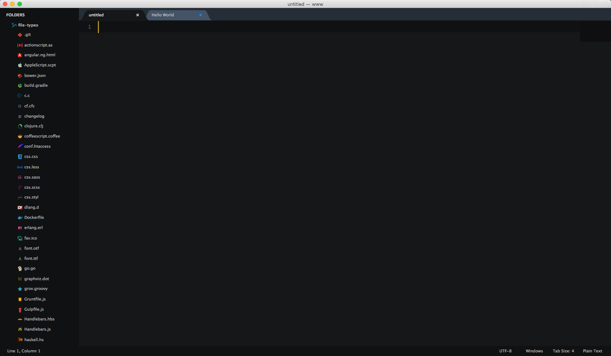
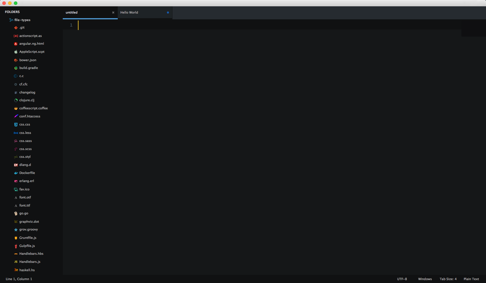

# Seti

`SublimeText 3 Theme` Port of Seti_UI by [jesseweed](https://github.com/jesseweed/seti-ui)

### Seti



### Seti_orig



## Notes

* [Seti_UX](https://sublime.wbond.net/packages/Seti_UX) A New/Better syntax Highlight.
* [Seti_JetBrains](https://github.com/zchee/Seti_JetBrains) by [zchee](https://github.com/zchee) :tophat:.

## Install

### Via Package Control

Theme is listed as [Seti_UI](https://packagecontrol.io/packages/Seti_UI) on Will Bond's [Sublime Package Control](https://packagecontrol.io).

### Manual

1. [Download the .zip](https://github.com/ctf0/Seti_ST3/archive/master.zip).
2. Unzip and rename the folder to `Seti_UI`.
3. Copy the folder into `Packages` directory, which you can find using the menu item `Preferences -> Browse Packages...` in Sublime Text.
4. copy the (Resource/fold.png) "or edit it to ur liking" to `Packages/Theme - Default` to override the default code folding icon.

## Setup

Activate the `Theme` by modifying your user preferences file, which you can find using the menu item `Preferences -> Settings - User` in Sublime Text or use `Schemr` & `Themr` by [Ben Weier](https://github.com/benweier).

### Example settings

```json
{
    "theme": "Seti_orig.sublime-theme"
}
```

#### Options

`Themr` have an option call ``Themr: Toggle Theme Settings`` to change theme settings on-the-fly , or manually add what you need from below.
* note that not all the settings are available in both themes.

```js
// tabs
  "Seti_tabs_small"                // tabs height = 35
  "Seti_tabs_med"                  // tabs height = 40
  "Seti_tabs_big"                  // tabs height = 54
  "Seti_tabs_no_min_width"         // (issues/223)
  "Seti_tab_font_12"               // tab font size = 12
  "mouse_wheel_tabswitch"          // scroll through opened tabs
  "Seti_no_scroll_icons"           // remove the l/r arrows & the drop down list button, effective when ("enable_tab_scrolling": true)
  "Seti_no_under_bar"              // remove the small colored bar under the un-saved tabs "not available with accents"
  "Seti_bold_slctdtab_labels"      // make active tab label font in bold

// tabs unsaved bar ("Seti_accent_*": false)
  "Seti_yellow_tab"
  "Seti_red_tab"
  "Seti_indigo_tab"
  "Seti_purple_tab"
  "Seti_teal_tab"
  "Seti_lime_tab"

// tab close button ("Seti_accent": false)
  "Seti_yellow_tabclose"
  "Seti_red_tabclose"
  "Seti_indigo_tabclose"
  "Seti_purple_tabclose"
  "Seti_teal_tabclose"
  "Seti_lime_tabclose"

// tab label
  "Seti_blue_label"
  "Seti_yellow_label"
  "Seti_red_label"
  "Seti_indigo_label"
  "Seti_purple_label"
  "Seti_teal_label"
  "Seti_lime_label"

// scrollbar
  "Seti_SB_med"                    // scrollbars width / height = 6
  "Seti_SB_big"                    // scrollbars width / height = 10
  "Seti_blue_scrollbar"
  "Seti_yellow_scrollbar"
  "Seti_red_scrollbar"
  "Seti_indigo_scrollbar"
  "Seti_purple_scrollbar"
  "Seti_teal_scrollbar"
  "Seti_lime_scrollbar"

// sidebar
  "Seti_ClosedFolder_same"         // same icon as the Opened_folder
  "Seti_ClosedFolder_remove"       // remove closed_folder icon
  "Seti_ClosedFolder_dots"         // change closed_folder icon to dot
  "Seti_ClosedFolder_anim"         // animate sidebar folder icons (available with accents)
  "Seti_sb_small_padding"          // sidebar entries padding = 3
  "Seti_sb_big_padding"            // sidebar entries padding = 10
  "Seti_sb_tree_med"               // sidebar tree padding = 15
  "Seti_sb_tree_small"             // sidebar tree padding = 10
  "Seti_sb_tree_tiny"              // (issues/88)
  "Seti_sb_tree_miny"              // (issues/88)
  "Seti_show_group_arrows"         // show the folder/group arrows in sidebar
  "Seti_sb_no_icons"               // (issues/133)
  "Seti_sb_blank"                  // (issues/133)
  "Seti_bold_slctdfile_labels"     // make the sidebar selected file text in bold
  "Seti_sidebar_font_size_12"      // (issues/115)
  "Seti_sidebar_font_size_13"      // (issues/115)
  "Seti_sidebar_font_size_14"      // (issues/115)
  "Seti_sidebar_font_Ubuntu"       // (issues/115)
  "Seti_sidebar_font_Fira"         // (issues/115)
  "Seti_sidebar_font_Hack"         // (issues/115)
  "Seti_sidebar_font_Source"       // (issues/115)
  "Seti_heading_font_12"           // heading font size = 12
  "Seti_bold_heading"              // make heading font in bold
  "Seti_top_heading_big"           // sidebar top header img big
  "Seti_top_heading_small"         // sidebar top header img small
  "Seti_top_heading_anim"          // sidebar top header img animate on hover "not available with accents"
  "Seti_alt_tree_row"              // alternative sidebar row highlight

// view
  "Seti_pad_5"                     // use with line_padding_bottom / line_padding_top = 5
  "Seti_pad_3"                     // use with line_padding_bottom / line_padding_top = 3
  "Seti_panel_nrml"                // remove the padding top/down from quick panel

// map shade
  "Seti_yellow_map"
  "Seti_red_map"
  "Seti_indigo_map"
  "Seti_purple_map"
  "Seti_teal_map"
  "Seti_lime_map"

// status bar
  "Seti_yellow_statusbar"
  "Seti_red_statusbar"
  "Seti_indigo_statusbar"
  "Seti_purple_statusbar"
  "Seti_teal_statusbar"
  "Seti_lime_statusbar"

// accents
  "Seti_accent"                    // general options for accents
  "Seti_accent_yellow"
  "Seti_accent_red"
  "Seti_accent_indigo"
  "Seti_accent_purple"
  "Seti_accent_teal"
  "Seti_accent_lime"
```

## Credits

* Ported based on `Glacier` by [joeyfigaro](https://github.com/joeyfigaro/glacier-theme) among many others.
* Special thanx for [Anthony Garand](https://github.com/garand) for the widget files (took me 2 days to understand what they actually do O_o and fix the god dame text input thing).
* `ScopeHunter` by [facelessuser](https://github.com/facelessuser) "YOU ROCK".
* `ColorSchemeEditor` by [Borislav Peev](https://github.com/bobef) "HOF".
* `Neon` by [Matt Morrison](https://github.com/MattDMo/Neon-color-scheme) "HOF".
* `Cyanide` by [lefoy](https://github.com/lefoy/cyanide-theme) "HOF".

## Differences from the original

* No file icon in the opened tabs, ST lacks this.
* Current line number highlight color, ST lacks this.

## Issue A Ticket

1. What version of ST are you using? (nothing lower than 3103).
2. Have you restarted ST after you installed the theme?
3. If you still have bad render, have you removed the cache folder (found right next to the packages folder)?
4. Have you copied the files from the `Ext` folder to your User folder?
