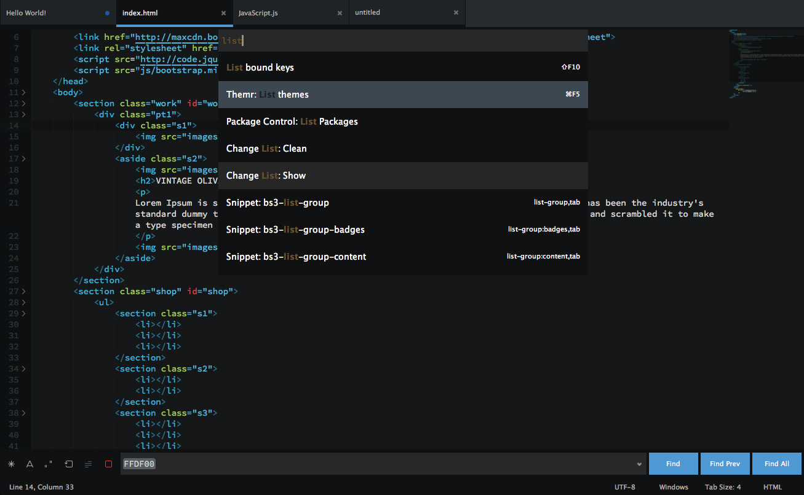

# Seti

`SublimeText3 Theme & ColorScheme` Port of Seti_UI & Syntax by [jesseweed](https://github.com/jesseweed/seti-ui)





# Notes
- This is my first of its kind so please if you found any bugs ,please issue a ticket.
- The theme is considered in beta-phase till the TODO list is done ,once that happen it will be available on Will Bond's [Sublime Package Control](https://sublime.wbond.net).
- I included a folder with some files types from `jesseweed` and `DanBrooker` to test the icon thing with.
- Theme havent been tested on anything other than 'ST3 Build 3062' ,any thing less than that wont get the sidebar icons to work.


## Install

### Via Package Control

Not Yet.

### Manual

1. [Download the .zip](https://github.com/ctf0/Seti_ST3/archive/master.zip).
2. Unzip and Copy the folder into `Packages` directory, which you can find using the menu item `Preferences -> Browse Packages...` in Sublime Text.
3. rename the unzipped folder to "Theme - Seti"
4. copy the "fold.png" to ur (default theme folder) to override the "focken default yellow" icon.

## Setup

Activate the UI theme and color scheme by modifying your user preferences file, which you can find using the menu item `Preferences -> Settings - User` in Sublime Text or by clicking `cmd + ,` on a Mac.

### Example settings
```
{
  "theme": "Seti.sublime-theme",
  "color_scheme": "Packages/Theme - Seti/Seti.tmTheme",
}
```

### Credits

Theme is Originally by [jesseweed](https://github.com/jesseweed/seti-ui) ,Ported based on `Glacier` by [joeyfigaro](https://github.com/joeyfigaro/glacier-theme) among many others ,special thanx for [Anthony Garand](https://github.com/garand) for the widget files (took me 2 days to understand what they actually do O_o and fix the god dame text input thing) ,`ScopeHunter` by [facelessuser](https://github.com/facelessuser) YOU ARE AWESOME ,`ColorSchemeEditor` by [Borislav Peev](https://github.com/bobef) , `Neon` by [Matt Morrison](https://github.com/MattDMo/Neon-color-scheme).


### TODO

1. Make the search input field shorter or "slimier" (depend on which side of the earth u r living).
2. Find a solution for the million file icons which ST lacks out of the box ,or at least get the recognized ones to display their correct icons as expected.
3. Clean up the "icon_?.tmPreferences" files so they actually do something.
4. Edit the color scheme to have different color for the same scope depends on file ext (js,html,css) ,some scops already have this ability but am looking to extend it even further.
5. haven't tested on Retina ,so anyone with Retina Mac plz test and report any found bugs.


### Differences from the original

- No file icon in the opened tabs, ST lacks this.

- Not as icon rich as the original because ST can't see anything other than Extensions ,and even thou its still hard to use the icon u want.

- Some scopes have different colors in Atom like the (:) ,this is related to the tmLanguage file in ST. (i included an Atom version of the same ColorScheme i made for sublime , install it and test it with the included JS file to see the difference).

- Current line number color, ST lacks this.

- Everything else is basically the same as the original except for some UI colors.
