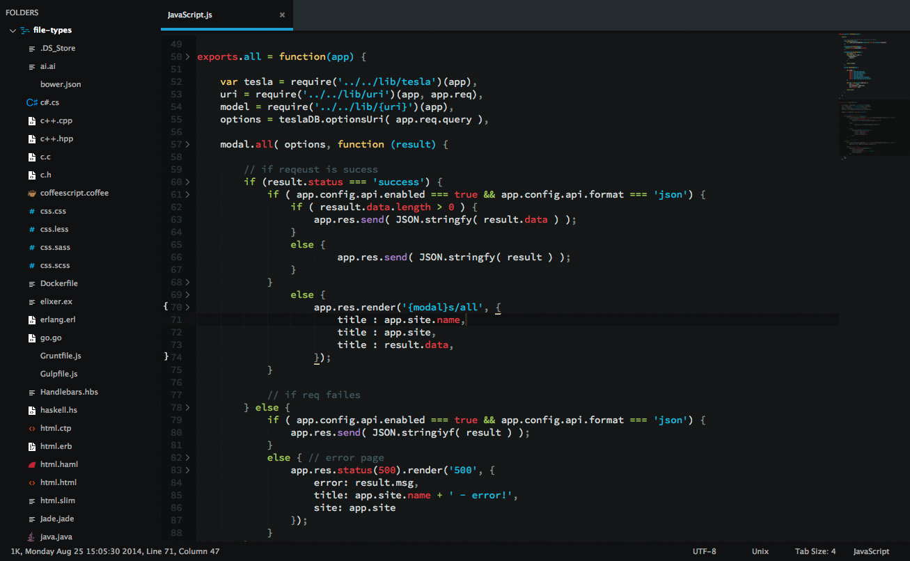
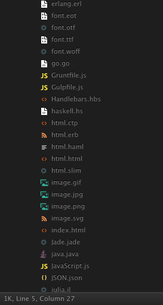

# Seti UI Icons for Sublime Text

These icons have been lifted from the [Seti_ST3](https://github.com/ctf0/Seti_ST3) Sublime Text port of [jesseweed's](https://github.com/jesseweed/seti-ui) Github Atom theme. You can use it with any other Sublime theme you like, but only if they're dark - [Soda Dark](https://github.com/buymeasoda/soda-theme/) works especially well.

The screenshots below show

## Install

### Via Package Control

Not Yet. Probably not ever :(

### Manual

1. [Download the .zip](https://github.com/mrmartineau/SetiUI-Icons-Sublime/archive/master.zip).
2. Unzip and Copy the folder into `Packages/User` directory, which you can find using the menu item `Preferences -> Browse Packages...` in Sublime Text.
3. rename the unzipped folder to the exact name of your current theme's parent folder, for example "Theme - Soda"
4. If your theme is Soda Dark 3, then create a new file called "Soda Dark 3" in the newly downloaded directory.
5. Restart Sublime :)

### Credits
- Seti UI port by [ctf0](https://github.com/ctf0/Seti_ST3)
- Theme is originally by [jesseweed](https://github.com/jesseweed/seti-ui) for Github's Atom editor.

# Notes
- There is a folder included with some files types from `jesseweed` and `DanBrooker` to test the icons.
- Anything less than 'ST3 Build 3062' wont get the sidebar icons to work.

### Differences from the original

- No file icon in the opened tabs, ST lacks this.
- Not as icon rich as the original because ST can't see anything other than Extensions ,and even though its still hard to use the icon you want.

