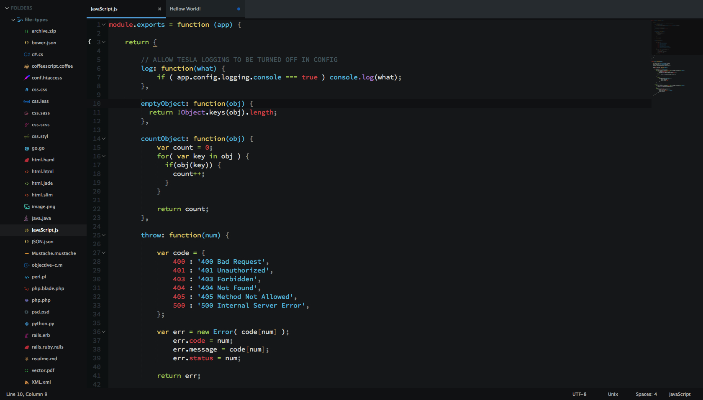
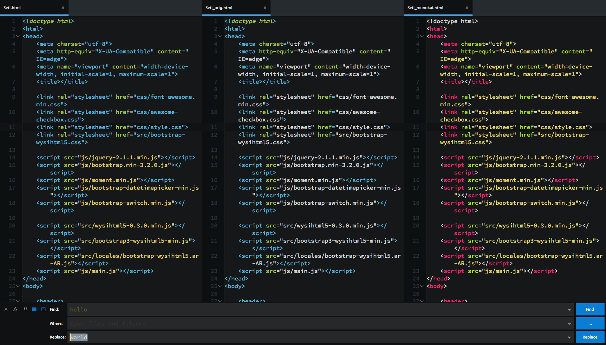

# Seti

`SublimeText 3 Theme & ColorScheme` Port of Seti_UI & Syntax by [jesseweed](https://github.com/jesseweed/seti-ui)





# Notes

- I included a folder with some files types from `jesseweed` and `DanBrooker` to test the icons ,you should probably add some of them to the "file_exclude_patterns" as ST wont open them anyway.

- Any thing less than 'ST3 Build 3062' wont get the sidebar icons to work.

- if you used any of the resources in this repo into your own release ,plz appreciate the hard work and mention the original authors.

- A New/Better syntax Highlight released under [Seti_UX](https://sublime.wbond.net/packages/Seti_UX).


## Install

### Via Package Control

Theme is listed as [Seti_UI](https://sublime.wbond.net/packages/Seti_UI) on Will Bond's [Sublime Package Control](https://sublime.wbond.net).

### Manual

1. [Download the .zip](https://github.com/ctf0/Seti_ST3/archive/master.zip).
2. Unzip and rename the folder to ``Seti_UI``.
3. Copy the folder into `Packages` directory, which you can find using the menu item `Preferences -> Browse Packages...` in Sublime Text.
4. copy the (+res/fold.png) "or edit it to ur liking" to ``Packages/Theme - Default`` to override the _focken default yellow icon.

## Setup

Activate the UI theme and color scheme by modifying your user preferences file, which you can find using the menu item `Preferences -> Settings - User` in Sublime Text or get `Schemr` & `Themr` by [Ben Weier](https://github.com/benweier).

### Example settings
```
{
  "theme": "Seti.sublime-theme",
  "color_scheme": "Packages/Seti_UI/Scheme/Seti.tmTheme",
}
```

#### Options
`Themr` have an option call ``Themr: Toggle Theme Settings`` to change theme settings on-the-fly , or manually add what you need from below.

```
{
  "Seti_mouse_wheel_tabswitch": true,     // allow tab switching with mouse wheel

  "Seti_no_bar_undertabs": true,          // remove the 4px bar under the tabs
  "Seti_tabs_small": true,                // tabs height = 35
  "Seti_tabs_med": true,                  // tabs height = 40

  "Seti_ClosedFolder_same": true,         // same icon as the Opened_folder
  "Seti_ClosedFolder_remove": true,       // remove closed_folder icon
  "Seti_ClosedFolder_dots": true,         // change closed_folder icon to dot

  "Seti_SB_med": true,                    // scrollbars width / height = 6
  "Seti_SB_big": true,                    // scrollbars width / height = 10
  "Seti_SB_bright": true,                 // brighter color for scrollbars

  "Seti_sb_small_padding": true,          // sidebar entries padding = 3
  "Seti_sb_big_padding": true,            // sidebar entries padding = 10
}
```


## Credits

- Theme is Originally by [jesseweed](https://github.com/jesseweed/seti-ui).

- Ported based on `Glacier` by [joeyfigaro](https://github.com/joeyfigaro/glacier-theme) among many others.

- Special thanx for [Anthony Garand](https://github.com/garand) for the widget files (took me 2 days to understand what they actually do O_o and fix the god dame text input thing).

- `ScopeHunter` by [facelessuser](https://github.com/facelessuser) "YOU ROCK".

- `ColorSchemeEditor` by [Borislav Peev](https://github.com/bobef) "HOF".

- `Neon` by [Matt Morrison](https://github.com/MattDMo/Neon-color-scheme) "HOF".


## Differences from the original

- No file icon in the opened tabs, ST lacks this.

- Not as icon rich as the original because ST can't see anything other than Extensions ,and even thou its still hard to make it use the icon you want.

- Some scopes have different colors in Atom like the (:) ,this is related to the tmLanguage file in ST ,also note that Atom sometimes will display a different color than ST "even if the scope name matches in both editors".

- Current line number highlight color, ST lacks this.

- Everything else is basically the same as the original except for a couple of UI colors.


## Issue A Ticket
 1. what version of ST are you using ? (nothing lower than 3062);
 2. have you restarted ST after you installed the theme ?
 3. if you still have bad render ,have you removed the cache folder ? (found right next to the packages folder)
 4. have you copied the files from the "Ext" folder to your User folder ?
